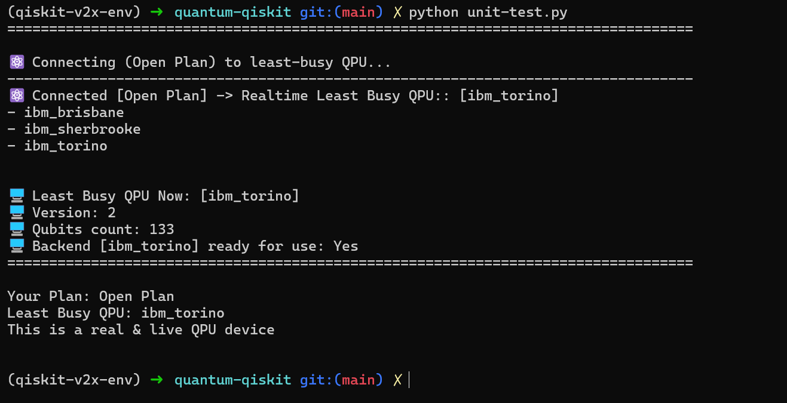

# qiskit-connector

[](https://github.com/schijioke-uche/pypi-qiskit-connector/actions/workflows/compatibility.yml) [](https://github.com/schijioke-uche/pypi-qiskit-connector/actions/workflows/quality.yml) [](https://doi.org/10.5281/zenodo.15304311) [](https://github.com/schijioke-uche/pypi-qiskit-connector/actions/workflows/coverage.yml) [](https://github.com/schijioke-uche/pypi-qiskit-connector/releases)

###### Install from Pypi: [https://pypi.org/project/qiskit-connector](https://pypi.org/project/qiskit-connector)

**⚛️IBM Quantum Qiskit Connector For Backend RuntimeService**

Qiskit Connector automates every step of your IBM Quantum backend connectivity workflow — from seamless authentication and dynamic plan detection to intelligent backend selection for Qiskit RuntimeService. Eliminate repetitive setup code: simply import the package and use the instantaneously available `backend` object throughout your quantum application code. Spend less time on configuration and more time innovating on real quantum solution.  This package performs the following:
- Loads environment variables from config file (e.g. `.env`) to configure your IBM Quantum account plan and make the `backend` object available within your quantum application code for reuse in real-time.
- Detects your active plan (Open, Standard, Premium, Dedicated) and sets up the correct channel/instance.
- It has functions to save your account using its (`qiskit_smart`), to verify QPU resources using (`qpu_verify`, `is_verified`), and retrieve a ready-to-use backend using (`connector()`). Presents you with the least-busy backend to run your quantum application code in realtime instead of you using simulators.

###### 🐍 Software built and maintained by Dr. Jeffrey Chijioke-Uche, IBM Quantum Ambassador & Research Scientist.
---

## 📋 Features & API

These functions are available after you import the module:

```python
from qiskit_connector import (
    connector,
    plan_type
)
```
- **`connector()`**  
  **Primary Integration Point:** Seamlessly initializes your IBM Quantum account, selects the optimal QPU (or the first available device for open/paid plans), and emits a clear diagnostics summary. It returns a fully configured `backend` object that you can immediately pass to Qiskit’s sampler, estimator, transpiler, or any circuit execution API—so you can focus on your quantum workflows rather than connection boilerplate.

- **`plan_type()`**  
  **Subscription Plan Resolver:** Automatically evaluates your environment configuration (via `.env` or system variables) to identify whether you’re operating under the **Open Plan** or a **Paid Plan**. This guarantees that your code consistently targets the correct IBM Quantum service tier, eliminating manual plan management and minimizing configuration drift.

---

## 🔧 Installation

```bash
pip install qiskit-connector
```

This will also pull in functionalities powered by:
- `qiskit>=2.0.0`  
  

and any other Qiskit dependencies. (Qiskit 1.x is not supported).

---

## 🗂️ Environment Variable Setup
🔐 Security Practice: Do not check-in `.env or environment variable config file` or any environment variable file into version control. Add it to your .gitignore. During development, create a file named `.env` at your project root. The connector will automatically load it.Use the template below as the content of your .env file or variable config file.

```dotenv

# GENERAL PURPOSE
#--------------------------------------------
IQP_API_TOKEN="<PROVIDE_YOUR_API_TOKEN>"  


# Channels:
#------------------------------------------
OPEN_PLAN_CHANNEL="<PROVIDE_YOUR_CHANNEL>"  
PAID_PLAN_CHANNEL="<PROVIDE PAID PLAN CHANNEL>"  # After July 1, 2025, use ibm_cloud for Paid Plans.


# API Access:
#-------------------------------------
IQP_API_URL=<PROVIDE_YOUR_API_URL>  
IQP_RUNTIME_API_URL=<PROVIDE_YOUR_RUNTIME_API_URL>  


# Quantum Url:
# The API URL. Defaults to https://cloud.ibm.com (when channel=ibm_cloud) 
# The API URL:Default to:  https://auth.quantum.ibm.com/api (when channel=ibm_quantum)"
#-------------------------------------
CLOUD_API_URL=<PROVIDE_YOUR_CLOUD_API_URL>  
QUANTUM_API_URL="<PROVIDE_YOUR_QUANTUM_API_URL>"  


# Instance:
#-------------------------------------
OPEN_PLAN_INSTANCE="<PROVIDE_YOUR_OPEN_PLAN_INSTANCE>"  
PAID_PLAN_INSTANCE="<PROVIDE_YOUR_PAID_PLAN_INSTANCE>"  


# Default (Open plan) - free
#----------------------------------------
OPEN_PLAN_NAME="open"


# Optional (Upgrade) - Standard
#-----------------------------------------
STANDARD_PLAN_NAME="standard"


# Optional (Upgrade) - Premium
#-----------------------------------------
PREMIUM_PLAN_NAME="premium"


# Optional (Upgrade) - Dedicated
#-----------------------------------------
DEDICATED_PLAN_NAME="dedicated"


# Switch "on" one plan: 
#--------------------------------------------------------------------------------------------------
OPEN_PLAN="on"        # [Default & switched on]  
STANDARD_PLAN="off"     
PREMIUM_PLAN="off"      
DEDICATED_PLAN="off"    
```
> **⚠️ Only one** of `OPEN_PLAN`, `STANDARD_PLAN`, `PREMIUM_PLAN`, or `DEDICATED_PLAN` may be set to **"on"** at a time.

---

## 📖 Usage

### Open Plan (default free tier) and Paid Plan

```python

from qiskit_connector import connector, plan_type
from qiskit_ibm_runtime import SamplerV2 as Sampler, Session

# QPU execution mode by plan: Use of 'backend' object.
current = plan_type()
backend = connector()

if current == "Open Plan":  # session not supported
    sampler = Sampler(mode=backend)
    print("Your Plan",current)
    print("Least Busy QPU:", backend.name)
    if isinstance(backend, IBMBackend):
        print("This is a real & live QPU device")
    else:
        print("This is a simulator")
    print(f"\n")
elif current == "Paid Plan":  # supports session
    with Session(backend=backend.name) as session:
        sampler = Sampler(mode=session)
        print("Your Plan",current)
        print("Least Busy QPU:", backend.name)
        if isinstance(backend, IBMBackend):
            print("This is a real & live QPU device")
        else:
            print("This is a simulator")
        print(f"\n")
else:
    raise ValueError(f"Unknown plan type: {current}")

# --- do other things below with backend, quantum circuit, sampler & transpilation ------
```


## Sample Output
```python
[✓] Quantum environment variables loaded successfully!

--------------------------------------------------------------------------------
[⚛] Connected [Open Plan] -> Realtime Least Busy QPU: ibm_torino
--------------------------------------------------------------------------------

Available QPUs (Open Plan):
  - ibm_brisbane
  - ibm_sherbrooke
  - ibm_torino

Default QPU:     ibm_torino
Qubit Version:   2
Number Qubits:   133

--------------------------------------------------------------------------------

Your Plan:       Open Plan
Least Busy QPU:  ibm_torino
This is a real & live QPU device

#-------- remaining code below ------
```



---
##  📜 Citation & Reference

Qiskit Connector software invention was inspired by IBM Research on Quantum Computing Qiskit Software, which led the authoring, design, development of Qiskit Connector based on the persistent reearch studies and tests carried out by  `Dr. Jeffrey Chijioke-Uche(IBM Quantum Ambassador & Research Scientist)` in the lab. This software is expected to continue to metamorphose with the help and work of existing quantum computing academic scholarly & peer reviewed research at different levels in the Information Technology industry. If you use Qiskit for Quantum computing, please cite this software as per the provided  file.

---

## 📜 Software Author & Publisher
Dr. Jeffrey Chijioke-Uche <br>
<i>IBM Computer Scientist</i> <br>
<i>IBM Quantum Ambassador & Research Scientist</i> <br>
<i>IEEE Senior Member (Computational Intelligence)</i>

---

## 📜 License

This project uses the Open-source 
